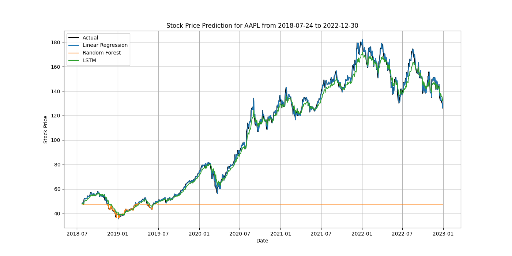
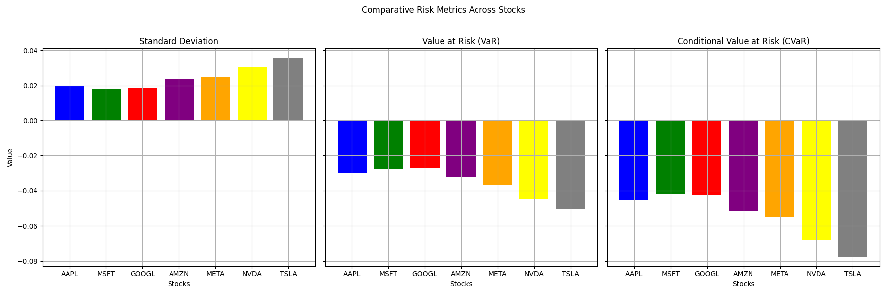
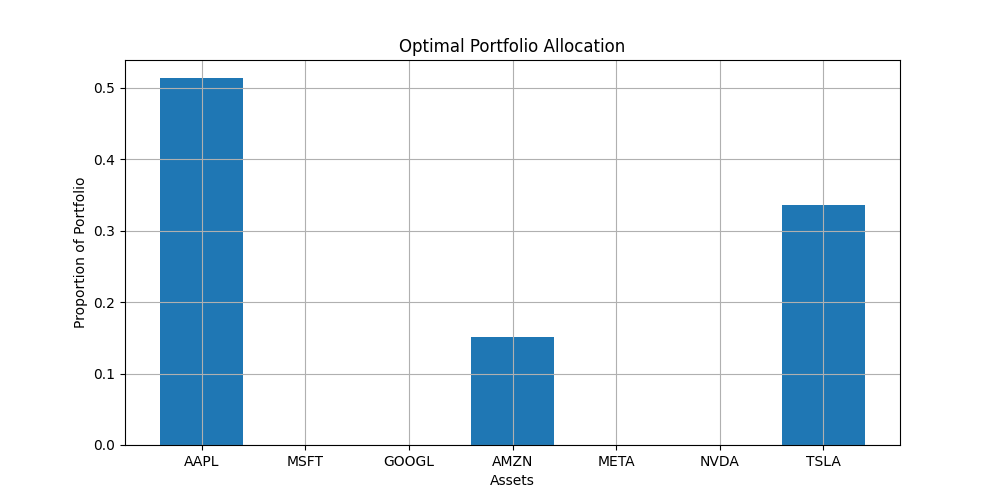

# Stock Prediction and Portfolio Optimization

This project combines **stock price prediction**, **portfolio optimization**, and **risk assessment** for a selected list of stocks, including `AAPL`, `MSFT`, `GOOGL`, `AMZN`, `META`, `NVDA`, and `TSLA`. By integrating machine learning models, risk metrics, and efficient portfolio theory, the project aims to provide insights into individual stock behaviors and optimal portfolio allocations based on modern portfolio theory.

## Project Overview

1. **Stock Price Prediction**: Utilizes three prediction models:
   - **Linear Regression**
   - **Random Forest Regressor**
   - **Long Short-Term Memory (LSTM) Network**
   
   Each model predicts stock prices based on historical data and technical indicators. Model performance is evaluated using metrics such as Mean Squared Error (MSE), Mean Absolute Error (MAE), Root Mean Squared Error (RMSE), and R² score.

2. **Risk Assessment**: Includes risk measures such as Standard Deviation, Value at Risk (VaR), and Conditional Value at Risk (CVaR) to gauge the financial risk associated with each stock.

3. **Portfolio Optimization**: Constructs an optimal portfolio by maximizing the Sharpe Ratio, balancing risk and return, using the Efficient Frontier approach.

## Structure

- **`preprocess_stock_data()`**: Cleans and prepares stock data by handling missing values and outliers.
- **`create_features()`**: Generates technical indicators, such as moving averages and lag features, as predictors.
- **`fetch_and_train_multiple_models()`**: Fetches data, trains prediction models, evaluates their performance, and assesses stock-specific risks.
- **`plot_stock_prediction()`**: Visualizes the actual vs. predicted stock prices.
- **`plot_risk_metrics()`**: Compares risk metrics across stocks.
- **`optimize_portfolio()`**: Constructs an efficient portfolio based on expected returns and covariance.

---

## Data Processing and Feature Engineering

Historical stock data is fetched from Yahoo Finance and preprocessed to handle missing values and outliers. Relevant technical indicators like 20-day and 50-day simple moving averages (SMA) and lagged values are added as features to assist in predictive modeling.

## Models Used for Stock Prediction

1. **Linear Regression**: Fits a linear model for stock price prediction based on selected features.
2. **Random Forest Regressor**: Ensemble model that improves prediction accuracy by aggregating results from multiple decision trees.
3. **LSTM (Long Short-Term Memory)**: Neural network model tailored for time-series data, capturing dependencies over time in stock prices.

Each model is evaluated using the following metrics:
   - **Mean Squared Error (MSE)**
   - **Mean Absolute Error (MAE)**
   - **Root Mean Squared Error (RMSE)**
   - **R² Score**

   ### Stock Prediction Plot
   

   This plot shows actual vs. predicted prices for different models (e.g., Linear Regression, Random Forest, LSTM) for each stock, helping to visualize model performance over time.

## Risk Metrics Analysis

The following risk metrics are used to assess each stock’s risk profile:

- **Standard Deviation (Volatility)**: Indicates the stock's price fluctuation, where a higher value suggests greater risk.
- **Value at Risk (VaR)**: Shows the potential maximum loss in a specified confidence level, typically set at 5%.
- **Conditional Value at Risk (CVaR)**: Average loss in extreme cases where losses exceed VaR.

   ### Comparative Risk Metrics Plot
   

   This plot provides a side-by-side comparison of the standard deviation, VaR, and CVaR for each stock in the selected portfolio.

## Portfolio Optimization

The portfolio is optimized based on historical returns and covariances of the selected stocks. Using the Efficient Frontier approach, the optimal weights for each stock are calculated to maximize the Sharpe Ratio, balancing return against risk.

The expected returns, covariances, and the calculated Sharpe Ratio are displayed to quantify the portfolio’s risk-return profile:

- **Expected Annual Return**: 31.8%
- **Annual Volatility**: 2.0%
- **Sharpe Ratio**: 14.53

   ### Portfolio Allocation Plot
   

   This plot shows the percentage allocation for each stock in the optimized portfolio.
